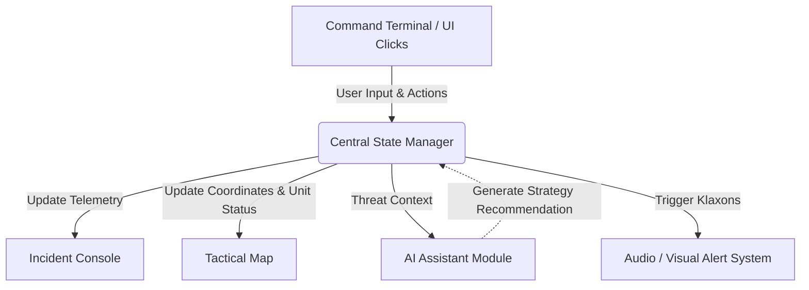

# DisasterGuard-AI 🚨

**DisasterGuard-AI** is a real-time, AI-powered tactical command center designed to revolutionize emergency response. Built with React and Vite, the platform simulates high-stakes crisis scenarios like wildfires, chemical spills, and urban flooding. Operators can monitor evolving threats on an interactive geographical map, deploy specialized responder units via a retro-styled command terminal, and consult a Gemini-powered AI core for strategic, on-the-fly tactical advice.

🌐 **[Live Demo](https://Kavi029-prog.github.io/DisasterGuard-AI/)**

---

## 🛑 The Problem

In an increasingly volatile world, the frequency and severity of natural and human-made disasters are escalating. Traditional emergency management often relies on disjointed communication channels, static maps, delayed reporting structures, and human operators who are overwhelmed by the sheer volume of incoming data. During the "golden hours" of a crisis, seconds lost to miscommunication or cognitive overload translate directly to increased risk to civilian lives and first responders. 

## 💡 The Solution

DisasterGuard-AI bridges the gap between chaotic field data and rapid decision-making. It provides a centralized, hyper-responsive command center that acts as a force multiplier for emergency dispatchers.

By integrating geographical visualization, direct responder unit management, and advanced AI-driven analysis into a single pane of glass, operators can instantly aggregate telemetry, deploy units via an interactive terminal, and receive tactical strategies from an embedded AI assistant.

## 🏗️ Architecture & Technologies

- **Frontend Framework**: React 19 & Vite for lightning-fast HMR and optimized production builds.
- **Styling**: Pure CSS with CSS Grid and Flexbox, utilizing custom variables for dynamic, high-contrast tactical theming.
- **State Management**: Unidirectional data flow leveraging React Hooks (`useState`, `useEffect`, `useCallback`) to synchronize the Terminal, Map, and Incident Console in real-time.
- **Audio Synthesis**: Native Web Audio API for zero-dependency, zero-latency klaxons and command beeps.
- **AI Core (Simulated)**: Integration ready for Gemini 2.5 Flash to provide on-the-fly tactical recommendations.

### System Flow


## 🚀 Setup Instructions

To run DisasterGuard-AI locally on your machine, follow these steps:

### Prerequisites
- Node.js (v18 or higher)
- npm

### Installation
1. **Clone the repository:**
   ```bash
   git clone https://github.com/Kavi029-prog/DisasterGuard-AI.git
   cd DisasterGuard-AI
   ```

2. **Install dependencies:**
   ```bash
   npm install
   ```

3. **Run the development server:**
   ```bash
   npm run dev
   ```

4. **View the application:**
   Open your browser and navigate to the local host address provided in the terminal (usually `http://localhost:5173/`).

## 📦 Deployment
This project is configured to easily deploy to GitHub Pages via the `gh-pages` package. 
To deploy a new build manually, simply run:
```bash
npm run deploy
```

---
*Built for the future of rapid crisis response.*
